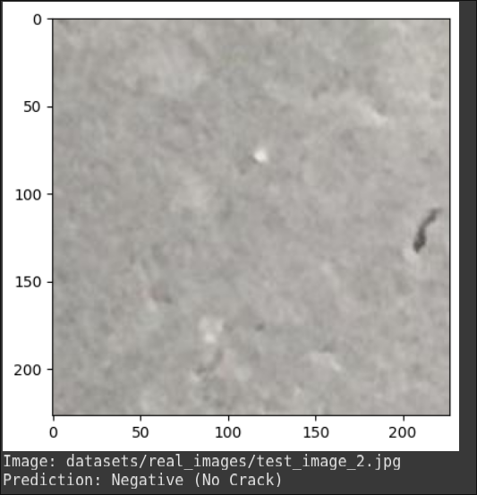
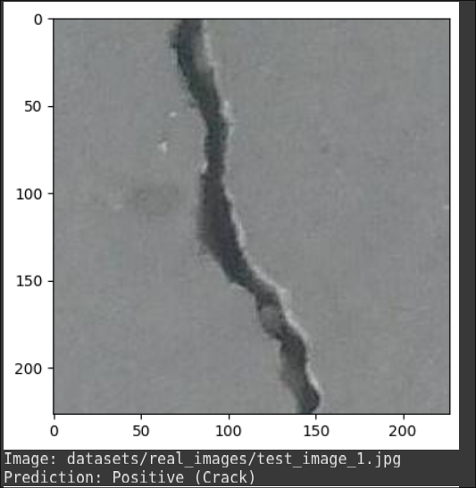

# surface-crack-detection
This project is our final assignment for the university AI/ML course, where we developed a model to classify whether a surface is cracked using image data. We implemented two CNN architectures(namely ResNet18 and VGG16) and evaluated them with and without transfer learning to analyze how pre-trained models influence detection accuracy. We also tested two optimizers, SGD and Adam, to compare their impact on overall model performance.

For the full detailed report, you can refer to our ResearchGate publication: 
(https://www.researchgate.net/publication/390668055_Image_classification_project_Surface_crack_detection)

Test result of our model:

---

---

